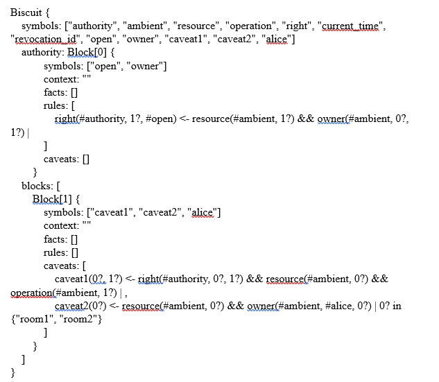

# xstate
State management (rooms) using a biscuit token (generated via the biscuitsec.org playground).


## Goal
We illustrate the potential of biscuit tokens on a building access management. We implemented an example of a verificator based on a state machine that accepts the room’s name and a serialized token to verify. If the verification succeed the state gets from idle to success and the room’s door will be opened; otherwise the state gets from idle to error and the door will remain closed.


## Install
We use npm to install the required packages and start the server. Please follow these instructions to launch the server

'npm install'

'npm start'


## Use


### Why do we need new bearer tokens that support delegation/ attenuation?

Delegation is a common mechanism in everyday life, but difficult with most software (you have to create an account, manage access lists, etc.). We focus on a specific case for buildings, for example for employees and their visitors.

Compared to state-of-the-art techniques, mostly designed with fixed scoped authorizations atop JWT tokens, the project shall provide a dynamic authentication token with the following properties:

- **distributed authorization**: any participant can validate the token only with public information (in contrast with macaroon that need a shared secret / we may also want to support 3rd party caveats),
- **offline delegation**: a new token can be minted from another one by attenuating its rights, by its holder, without communicating with anyone (a nice property for smaller devices),
- **capabilities based**: authorization is tied to rights related to the request, instead of relying to an identity that might not make sense to the verifier,
- **flexible rights managements**: the token uses a logic language to specify attenuation and add caveats on ambient linked data. In contrast to JWT, Biscuit allows situational/ambient control and is therefore dynamic,
- **small** enough to fit anywhere (thanks to HPACK compression), even on embedded devices,
- **seamlessly integrated** to existing open infrastructure

Here we illustrate how we use a Biscuit web token to manage access to a building (our concrete example).


### Example: controlling access to a building

To work on a concrete example and explain how the token works, we have chosen this simple plan.


We will manage access to the doors of the building and the rooms.

It is beyond the scope of this document to detail every part of the token semantics, here we're only concerned with providing an example which can be easily understood.

For more detailed information, please refer to our playground and detailed documentation.

If you already want to get more info, please get to https://github.com/CleverCloud/biscuit, which was targeted at microservices (for instance to manage pulsar queues). They provide an interesting implementation upon which we build further, for real life scenarii.

Our objective is to provide an intuition for what it does.


**Example of a token that gives access to the whole building for a person called Alice:**


The playground shows the encoded version (base64) of the token, and its corresponding decoded version:


**Explanation:**

This token contains two major parts: a rule (here: open) and caveats.


**1- The Authority Rule:** right(#authority, $1, #open) <- !resource(#ambient, $1), !owner(#ambient, $0, $1)

=> this rule means if the resource $1 is owned by $0 then he has the right to open it

=> #ambient means that the variables $0 and $1 will be read from the ambient data during the verification process

```rust
//adding ambient data
v1.add_resource("first_floor_porte_salle1");
v1.add_operation("open");
```


**2 - The Caveats:**

We can encode many conditions (e.g. time) to restrict the use of the token.

For instance:

*caveat1($0, $1) <- !right(#authority, $0, $1), !resource(#ambient, $0), !operation(#ambient, $1),

=> this caveat will check the operation ( #open ) on the resource $0

*if the operation $1 is permitted by the authority ( $1=#open ) this caveat will succeed, otherwise it will fail*

*caveat2($0) <- !resource(#ambient, $0), !owner(#ambient, #alice, $0)

=> this caveat will check that the owner of the resource $0 is Alice

The following code shows how we use ambient data to restrict the rule.

```rust
  let root = KeyPair::new(&mut rng);
  let public_key = root.public();
  let keypair2 = KeyPair::new(&mut rng);

  // creating a first token
  let token1 = {
    // the first block of the token is the authority block. It contains global
    // information like which operation types are available
    let mut builder = Biscuit::builder(&mut rng, &root);
    // let's define some access rights
    // every fact added to the authority block must have the authority fact
    builder.add_authority_rule(rule(
      // the rule's name
      "right",
      // the "head" of the rule, defining the kind of result that is produced
      &[var(1), s("open")],
      // here we require the presence of a "resource" fact with the "ambient" tag
      // (meaning it is provided by the verifier)
      &[
        pred("resource", &[s("ambient"), var(1)]),
        // we restrict to read operations
        pred("owner", &[s("ambient"), var(0), var(1)]),
      ],
    ));

    // we can now create the token
    let mut biscuit = builder.build()?;
    println!("biscuit (authority): {}", biscuit.print());

    biscuit.to_vec()?
  };
```

### Implementing access verification using a state machine

We implemented an example of a verification based on a state machine that accepts the room’s name and a serialized token to verify, if the verification succeed the state pass from idle to success and the the room’s door will be opened otherwise the state pass from idle to error and the door will remain closed.

Just a visual reminder of what is a state machine: you have states and transitions between states


The example uses xstate as a library to manage room states.

```jsx
stateMachine = Machine({
    initial: "idle",
    context: {
      msg: ""
    },
    states: {
      idle: {
        on: {
          SUBMIT: [
            {
              target: "loading",
              cond: (ctx, event) =>
                event.data.room_name !== "" && event.data.token !== ""
            },
            {
              target: "error"
            }
          ]
        }
      },
      loading: {
        invoke: {
          id: "doOpening",
          src: (ctx, event) => Open(event.data),
      //if the function open() valid the verification the state machine will pass to success state, else it will pass to error state
   onDone: {
            target: "success",
            actions: assign({ msg: (ctx, event) => event.data })
          },
          onError: {
            target: "error",
            actions: assign({ msg: (ctx, event) => event.data })
          }
        }
      },
	// error state 
      error: {
        on: {
          SUBMIT: {
            target: "loading",
            cond: (ctx, event) => event.data.room_name !== "" && event.data.token !== ""
          }
        }
      },
	//success state
      success: {
        type: "final"
      }
    }
  });
```

**Token verification:**

We use webassembly to interact with the rust library.

```jsx
<button
                id="VerifButton"
                className="btn btn-block btn-success submit-button"
                type="submit"
                
                onClick={async (e) => {
			          //deserialize the token
                let data = new Uint8Array(atob(this.state.token).split("").map(function (c) {
                    return c.charCodeAt(0);
                }));
			
                let token = wasm.Biscuit.from(data);
			          //create a new verifier
                let verifier = new wasm.Verifier()
			          //adding ambient data
			          //adding the room_name as a resource to verify by the verifier
                verifier.addResource(this.state.room_name);
			          //adding the operation to verify
                verifier.addOperation("open");
			          // adding a fact to verify
			          // verify if alice owns the resource room_name
                verifier.addFact(wasm.fact(
                                 "owner",
                                 [{ sym-bol: "ambient" }, { symbol: "alice" }, { string: this.state.room_name }],

                ))

                // create a rule
                let rule = wasm.rule(
                      "right",
                      [{ symbol: "right" }],
                      [
                          {
                              name: "right",
                              ids: [{ symbol: "authority" }, { string: this.state.room_name }, { symbol: "open" }]
                          }
                      ]
                )
			          //adding the rule to the verifier
			          // this rule will verify if the token owner has the right to open the resource room_name
                verifier.addCaveat(rule);
			          //decoding the root private key
                let decoded = fromHex(this.state.privateKey);
			          //creating biscuit root keypair from the root private key
                let k = wasm.KeyPair.fromBytes(decoded);
                try {
			                //verifying the token and the root public key 
                      let result = verifier.verify(k.publicKey(), token);
			                //if the verification succeed this.state.verification will be set to “OK”
                      this.setState({ verification: "OK" });
                      //wait two seconds to retain the modification of the state
                      await new Promise(r => setTimeout(r, 2000));
                      //if the verification fail this.state.verification will be set to “FAILED”
                    } catch(error) {
                      this.setState({ verification: "FAILED" });
                    }
                    e.preventDefault();
			              //the verification result will be sent to the state machine 
                    send({ type: "SUBMIT", data: { ...this.state } });
}}>
```

The example below is dedicated to the owner of the building that we suppose his name is Alice, it gives the access to all the rooms because we didn’t set any restriction to the verified resource, so the result will be positive.


Encoded token that you can use to test this scenario for room1 (use "copy to clipboard" to be sure of what you paste in the Token section):

```
Ck0IABIEb3BlbhIFb3duZXIiPAoUCAQSBAgAEAASBAgBGAESBAgAEAcSDggCEgQIABABEgQIARgBEhQICBIECAAQARIECAEYABIECAEYARKVAQgBEgdjYXZlYXQxEgdjYXZlYXQyEgVhbGljZSpGCg4ICRIECAEYABIECAEYARIUCAQSBAgAEAASBAgBGAASBAgBGAESDggCEgQIABABEgQIARgAEg4IAxIECAAQARIECAEYASowCggIChIECAEYABIOCAISBAgAEAESBAgBGAASFAgIEgQIABABEgQIABALEgQIARgAGiCYTrUgeUj8jBGITj9LkCwonP0Nm06ybJ7dn4BQCvIleRogIqLWCgbnZBUUzC7+a0WIGYehwXgb3lNA7ew7hMQX82AiZgogZmOn13vwqSpWSy0eFp4X5j7rrKrh3J7s//WV0C8IEEsKIGhhvmt5ONA7Yx8swMWbN7+J6nza2gki8M5QK5ylnqlWEiC6HkuwjOfNaPlSCctB4oJotKTm8fFjhgLBgsXVcP4KDA==
```

### Example of a more restricted token

The difference between the first and this token is the restriction on the resource, which we declare it must be in [“room1”,”room2”]



The verification gives:


Encoded token that you can use to test this scenario:

```
Ck0IABIEb3BlbhIFb3duZXIiPAoUCAQSBAgAEAASBAgBGAESBAgAEAcSDggCEgQIABABEgQIARgBEhQICBIECAAQARIECAEYABIECAEYARKtAQgBEgdjYXZlYXQxEgdjYXZlYXQyEgVhbGljZSpGCg4ICRIECAEYABIECAEYARIUCAQSBAgAEAASBAgBGAASBAgBGAESDggCEgQIABABEgQIARgAEg4IAxIECAAQARIECAEYASpICggIChIECAEYABIOCAISBAgAEAESBAgBGAASFAgIEgQIABABEgQIABALEgQIARgAGhYIABABIhAIAyoFcm9vbTIqBXJvb20xGiCYTrUgeUj8jBGITj9LkCwonP0Nm06ybJ7dn4BQCvIleRog+H2tf8+vpIyegPNWYLM4+etmBpSUYtOwIx8w/oXMagMiZgogjHCH45o6rlvPzqkYne5rx2Q2DrM+Gr4klPZW96QpGykKIKiUnX39R3dvwH7NNAzCjWvOiA7dFtrw6dMk8xalzewiEiC7yMENbkxaoNCCuWd1/Esk6jI1X6KVC4UFaFZ6tsJBBA==
```


